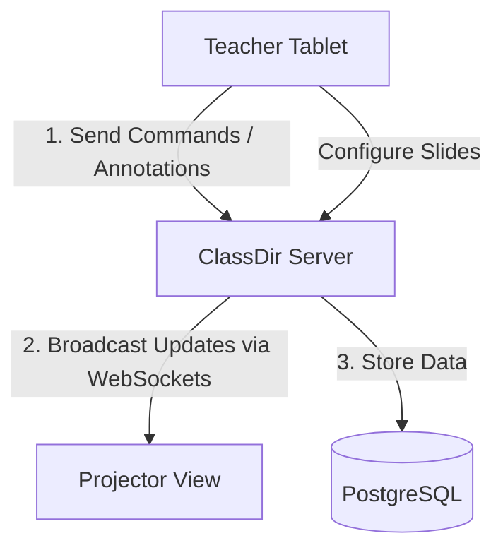
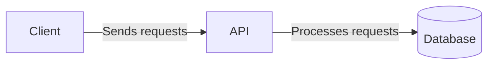

# System Architecture

This system is designed to facilitate the management and presentation of educational slides in a classroom setting.



## Containers

This system is composed of three main containers:



### List of Containers

|Container|Location|Stack|Description|
|---|---|---|---|
|Client|`/client`|React, Typescript, Reveal.js|Responsible for the user interface, allowing teachers to configure slides, control, and visualize presentations.|
|API|`/api`|Go|The API container handles requests from the client, processes commands, and communicates with the database to store and retrieve presentation data.|
|Database|`/database`|PostgreSQL|The database container stores all presentation data, including slides, and student interaction records.|

- The client handles three main views: the configuration view, the controller view and the presentation view. The configuration view allows teachers to set up slides, the controller view allows teachers to move between slides, annotate, etc., while the presentation view displays the slides and allows for real-time interaction.
- A presentation id is used to identify the presentation and allow the teacher's presentation device and students to join the same room to view the slides and participate in the activities.

## Communication

- The client communicates with the API using WebSockets for real-time updates and RESTful APIs for standard requests.
- The data format for communication between the client and API is JSON, ensuring a lightweight and easily parseable structure for data exchange.
- The API communicates with the database using SQL queries to store and retrieve data efficiently.
- Authentication and authorization are handled via JWT tokens and a secret password stored in a .env file since this is a personal app. This behavior is likely to change in the future to support multiple users and roles.
- All server responses implement the following structure:
```json
{
    "data": {} // The data object contains the response data, which can be any valid JSON structure.
}
```
- All server errors implement the following structure:
```json
{
    "error": {
        "code": "string",
        "message": "string",
        "details": {} // An optional object containing additional details about the error, which can be any valid JSON structure.
    }
}
```
- Due to the instability of the WebSocket connection, the client implements a reconnection strategy to ensure that the connection is re-established in case of disconnection. The client also handles any errors that may occur during the WebSocket communication and provides appropriate feedback to the user.

## Domain Rules & Core Concepts

- **Blocking Configuration**: Slides content and student registration are locked once the presentation starts. The teacher can still add/remove pre-registered students from the spin wheel during the session.

- **Slide-Bound Annotations**: Annotations are strictly attached to individual slides (similar to PowerPoint or Google Slides). When a teacher changes slides, the canvas clears to display the next slide's annotations.
- **No Persistent Annotations**: Annotations are not stored in the database; they exist only for the duration of the presentation session. Once the session ends, all annotations are lost.

## Commands and Endpoints

- The system supports a variety of commands and endpoints that can be sent from the client to the API to control the presentation and manage slides.

## AI Agents Instructions

1. Cross-container changes: If a task in one container requires changes in another container, you must first update all contracts and shared types before touching the internal logic of each container.
2. Isolation: Each container should be treated as an isolated unit. Changes in one container should not affect the internal logic of another container unless explicitly required by the task. Ignore the design patterns of the other containers and focus on the internal logic of the container you are working on.
3. To-do list: A list of tasks is provided in ./docs/todo/\[name\].md files. You should follow the instructions in these files to complete your tasks. DON'T make assumptions about the requirements or implementation details. DON'T change the requirements or implementation details without explicit instructions. If you have any questions or need clarification, please ask for help.
